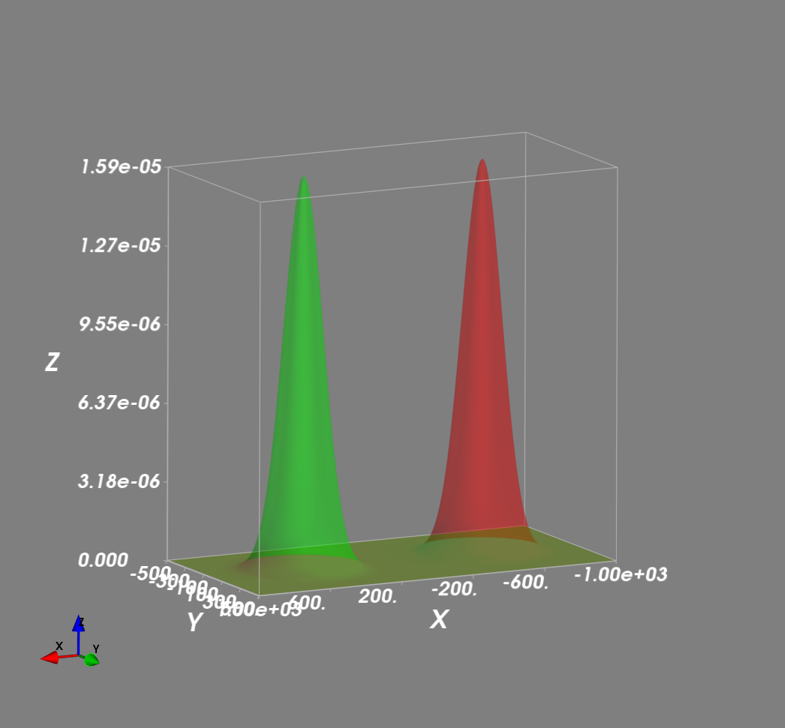

Gaussian Component
==================

:class:`pymrt.tracking.utils.GaussianComponent` class implements a object
class for Gaussian Component used in Guassian Mixture propagation calculation.
Each Gaussian Component is defined with weight, mean vector, and covariant
matrix.
Methods in the class provides calculation for merging, and propagating
Gaussian mixtures.

The following shows the proper usage and test case in verifying those functions.

.. literalinclude:: /../../test/mtt/gm_test.py

Function :func:`plot_2d_gm` plot two 2D Gaussian distribution density side by
side centralized at (-500, 0) and (500, 0) for comparison.

In this example, the Gaussian density has a covariance matrix of

.. math::
    cov = \left[
    \begin{matrix}
    10000 & 0\\
    0 & 10000
    \end{matrix}
    \right]

The peak of the density distribution is

.. math::
    max(\mathcal{N}) = \frac{1}{\sqrt{2\pi 10000}} = 1.59\times 10^{-5}

You can verify the value according to the plotted graph.

